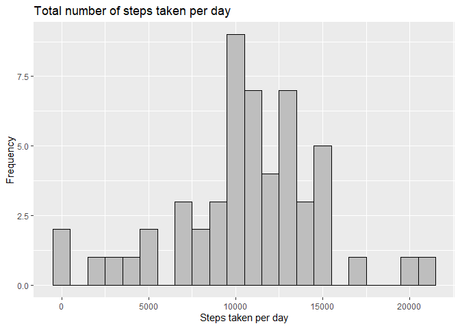
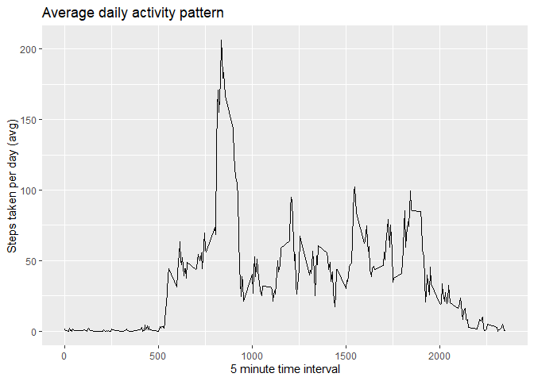
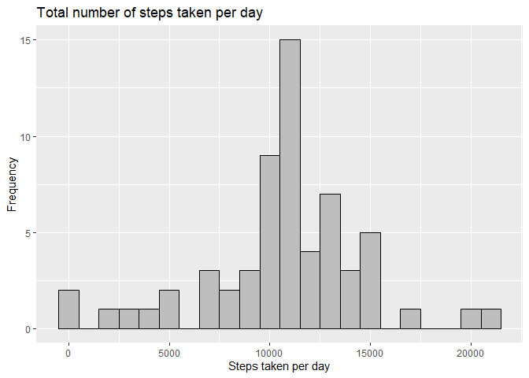
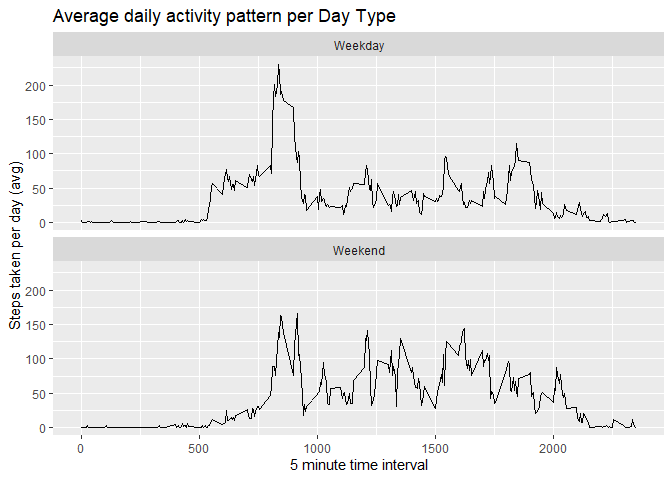

## Setup libraries and code shunks options


```r
library(knitr)
library(data.table)
library(ggplot2)
library(dplyr)
library(lubridate)

opts_chunk$set(echo = TRUE, results = 'hold')
```


## Loading and preprocessing the data

In this portion we are going to download the project data and load it in to a data table to facilitate the analysis of the data down the line.


```r
# Get the data for the project from the provided link
url <- "https://d396qusza40orc.cloudfront.net/repdata%2Fdata%2Factivity.zip"
filePath <- getwd()
fileName <- "projectData.zip"
download.file(url, file.path(filePath, fileName))
unzipedFile <- unzip(zipfile = fileName)

startOfPathToRemove <- "^\\./"
dataFilePath <- file.path(filePath, gsub(startOfPathToRemove, "", unzipedFile))

data <- fread(dataFilePath, colClasses = c('numeric','Date','numeric'))
```


## What is mean total number of steps taken per day?

In order to get a better idea of the distribution of the amount of steps taken each day we are going to plot a histogram of this information.


```r
# Sum up steps by date
stepsPerDate <- data %>%
                group_by(date) %>%
                summarise(total_steps = sum(steps))
```

```
## `summarise()` ungrouping output (override with `.groups` argument)
```

```r
ggplot(stepsPerDate, aes(total_steps)) + 
    geom_histogram(binwidth = 1000, color="black", fill="grey") +
    ggtitle("Total number of steps taken per day") +
    ylab("Frequency") +
    xlab("Steps taken per day")
```

```
## Warning: Removed 8 rows containing non-finite values (stat_bin).
```

<!-- -->

```r
stepsPerDateMean   <- round(mean(stepsPerDate$total_steps, na.rm=TRUE), 2)
stepsPerDateMedian <- round(median(stepsPerDate$total_steps, na.rm=TRUE), 2)
```

The mean and median values are presented below:  
- **Mean:** 10766.19  
- **Median:** 10765


## What is the average daily activity pattern?

To get a better sense of what an average day looks like in terms of activity, we can plot the average daily activity pattern.


```r
# Calculate average steps for each interval
averageStepsPerInterval <- data %>%
                           group_by(interval) %>%
                           summarise(steps = mean(steps, na.rm = TRUE)) %>%
                           arrange(interval)
```

```
## `summarise()` ungrouping output (override with `.groups` argument)
```

```r
ggplot(averageStepsPerInterval, aes(x = interval, y = steps)) +
    geom_line() +
    ggtitle("Average daily activity pattern") +
    xlab ("5 minute time interval") +
    ylab ("Steps taken per day (avg)")
```

<!-- -->

We can clearly see that there's an certain interval with an average higher activity than others. What is it?


```r
averageStepsPerInterval$hourMinuteInterval <- as.POSIXct(strptime(sprintf("%04d", averageStepsPerInterval$interval), "%H%M")) 
maxActivityInterval <- averageStepsPerInterval[which.max(averageStepsPerInterval$steps),]
```

The point visually identified in the plot corresponds to interval around 08 hours and 35 minutes, where the average number of steps is 206.


## Imputing missing values

The original data has 2304 cases of missing values, which can introduce bias into some calculations or summaries of the data. In order to mitigate this problem, we are going to create a new data set with the missing values filled in by the corresponding 5 min interval average and redo the histogram of the total number of daily steps using the completed data.


```r
# Replace missing steps with interval averages across days
completedData <- data %>%
                 mutate(steps = case_when(is.na(steps) ~ 
                                          averageStepsPerInterval$steps[match(data$interval,
                                                                              averageStepsPerInterval$interval)],
                        TRUE ~ as.numeric(steps)))

# Sum up steps by date
completedStepsPerDate <- completedData %>%
                         group_by(date) %>%
                         summarise(total_steps = sum(steps))
```

```
## `summarise()` ungrouping output (override with `.groups` argument)
```

```r
compltedDataMissingCases <- sum(!complete.cases(completedData))

ggplot(completedStepsPerDate, aes(total_steps)) + 
    geom_histogram(binwidth = 1000, color="black", fill="grey") +
    ggtitle("Total number of steps taken per day") +
    ylab("Frequency") +
    xlab("Steps taken per day")
```

<!-- -->

```r
completedStepsPerDateMean   <- round(mean(completedStepsPerDate$total_steps), 2)
completedStepsPerDateMedian <- round(median(completedStepsPerDate$total_steps), 2)
```

The result is a dataset with 0 missing cases. where the new mean and median values are presented below:  
- **Mean:** 10766.19  
- **Median:** 10766.19
This means that even though there's no noticeable impact on the mean, the median was shifted to basically match the mean. Looking at the histogram, one can observe that there peak shifted a bit but the overall distribution is still similar.

## Are there differences in activity patterns between weekdays and weekends?

Now we want to evaluate the difference in activity patterns during the day between a day of the week and the weekend. With that goal in mind, we will start by segmenting the data in weekdays and weekends and plot the average daily activity pattern.


```r
# Segment the data in Weekdays and Weekends
segmentedData <- completedData %>%
                 mutate(date = ymd(date),
                        dayType = case_when(wday(date) %in% 2:6 ~ "Weekday",
                                            wday(date) %in% c(1,7) ~ "Weekend")) %>%
                 select(-date) %>%
                 group_by(interval, dayType) %>%
                 summarise(steps = mean(steps))
```

```
## `summarise()` regrouping output by 'interval' (override with `.groups` argument)
```

```r
ggplot(segmentedData, aes(interval, steps)) + 
    geom_line() +
    facet_wrap(~dayType, nrow = 2) +
    ggtitle("Average daily activity pattern per Day Type") +
    xlab ("5 minute time interval") +
    ylab ("Steps taken per day (avg)")
```

<!-- -->

From the plot above, some interesting patterns can be observed. On a first glance, one can easily observe that the participant usually wakes up later on weekends and ends up having more activity during the day. On the other hand, there's a noticeable smaller spike during the early portion of the day in comparison with a day of the week.
The end of the day has a similar pattern, where during the weekdays activity seems to cease earlier than during the weekends.
